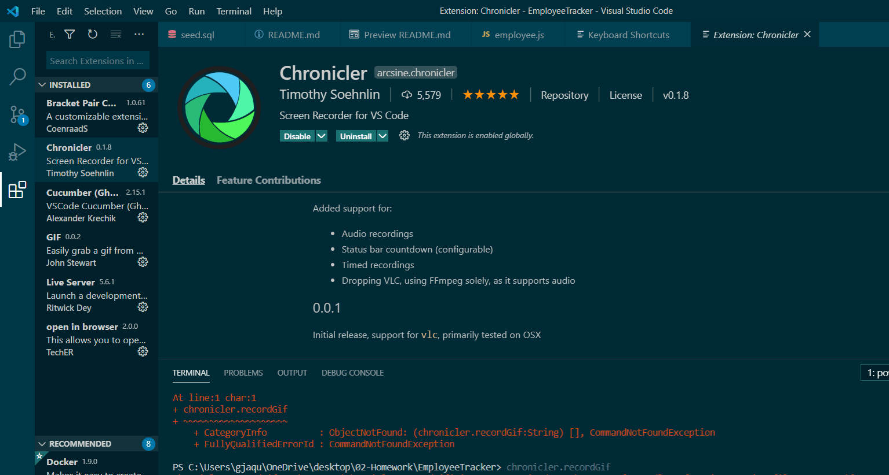

# Employee Tracker
  The purpose of this application is to navgiate a SQL database for a company. There are 3 tables: employee, department, and role.

  #### TABLE OF CONTENTS 
  * [Installation](#Installation)
  * [Usage](#Usage)
  * [Contribution](#Contribution)
  * [Test](#Test)
  * [License](#License)
  * [GitHub](#GitHub)
  * [Contact](#Contact)
  * [Recording](#Recording)

  ## Installation
  install npm inquirer and npm mysql

  ## Usage Information
   This application is used for any company that would like to organize their employee directory. 

  ## Contribution 
  fork the repo and create your own branch 

  ## How to Test 
  Clone or download the repo and run the application 

  ## GitHub Username 
  @buildGal

  ## Contact Me 
  Email: [gjaquelin7@outlook.com]

  ## Recording
  

